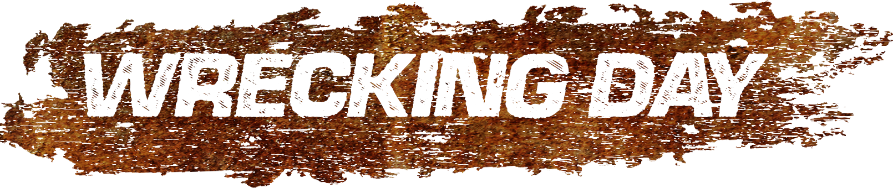

# WRECKING DAY

Wrecking Day is a Demolition Derby videogame in which you must be the sole competitor to remain in the arena by destroying your opponents. Players will have to display and prove their driving and skidding skills and make use of ramps in order to take advantage and win the game..

This is a game being developed by students from <a href="https://www.imagecampus.edu.ar/">Image Campus</a>

   

## Credits

- **Lucas Pich** - *Programming*
- **Micaela Luz Benitez** - *Programming*
- **Juan Martin Fernandez** - *Art*
- **Melina Klurfan** - *Art*
- **Facundo Vieyra** - *Art*
- **Lucas Quiñones** - *Art*

This game was also possible thanks to the support of these professors:

- **Rodrigo Andres Magariños**
- **Matias Ruiz Torres**
- **Julian Uriel Bega Milrad**

## Links

https://wrecking-day.itch.io/wrecking-day
